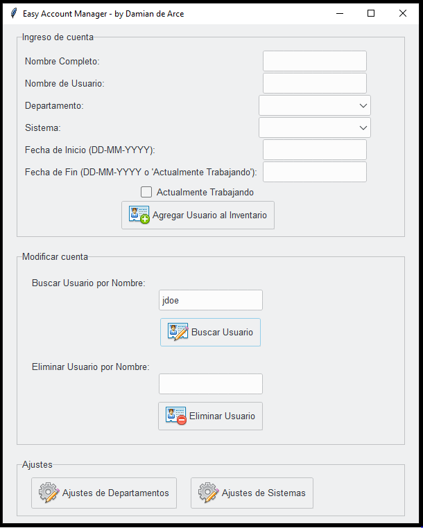

<h1 align="center">Easy Account Manager</h1>

  

  <em>Simplifica la gestión de cuentas de usuario / Simplify user account management.</em>

  <a href="https://github.com/ddearce/SecOps/releases/tag/EAM"><strong>Descargar Ejecutable</strong></a>

  <a href="https://github.com/ddearce/SecOps/releases/tag/EAM"><strong>Download Executable</strong></a>

---

Easy Account Manager (EAM) es una aplicación escrita en Python diseñada para ayudarte a gestionar y hacer un seguimiento de las cuentas de usuario. Ofrece una interfaz de usuario intuitiva y funciones esenciales para mantener un registro de la información de usuario dentro de tu organización.

Easy Account Manager (EAM) is a Python application designed to assist you in managing and keeping track of user accounts. It provides an intuitive user interface and essential features to maintain a record of user information within your organization.

---

## Features / Características

- **Gestión de Cuentas de Usuario**: Agrega y almacena fácilmente información de cuentas de usuario, incluyendo nombre completo, nombre de usuario, departamento, sistema, fecha de inicio y fecha de finalización.
  
  **User Account Management**: Easily add and store user account information, including full name, username, department, system, start date, and end date.

- **Búsqueda de Usuario**: Encuentra rápidamente cuentas de usuario buscando por nombre de usuario.
  
  **User Search**: Quickly find user accounts by searching for usernames.

- **Modificación de Usuario**: Actualiza y modifica la información de cuentas de usuario existentes.
  
  **User Modification**: Update and modify existing user account information.

- **Eliminación de Usuario**: Elimina cuentas de usuario del inventario cuando ya no son necesarias.
  
  **User Deletion**: Remove user accounts from the inventory when no longer needed.
  
- **Configuración de Ajustes**: Personaliza la lista de departamentos y sistemas según las necesidades de tu organización.
  
  **Settings Configuration**: Customize the list of departments and systems according to your organization's needs.
  

## Empezando / Getting Started

Para usar Easy Account Manager, sigue estos pasos de instalación / To use Easy Account Manager, follow these installation steps:

1. **Clona este Repositorio / Clone the Repository**: Clona o descarga este repositorio en tu máquina local / Clone or download this repository to your local machine.
   
3. **Ve al directorio del proyecto / Go to the project directory**: Abre una terminal o línea de comandos y navega al directorio del proyecto / Open a terminal or command prompt and navigate to the project directory.
   
4. **Ejecuta el programa / Run the program**: Ejecuta el siguiente comando para iniciar la aplicación (o ejecuta el .exe) / Run the following command to start the application: `eam.py` (or run the .exe)

## Capturas de Pantalla / Screenshots

## Uso / Usage

**Agregar una Cuenta de Usuario / Add a User Account**

1. Ingresa el nombre completo del usuario, el nombre de usuario, selecciona un departamento, elige un sistema y especifica la fecha de inicio y fecha de finalización (o marca "Trabajando Actualmente").

   Enter the user's full name, username, select a department, choose a system, and specify the start and end dates (or mark "Currently Working").

3. Haz clic en el botón "Agregar Usuario al Inventario"

   Click the "Add User to Inventory" button.

**Buscar un Usuario / Search for a User**

1. Ingresa el nombre de usuario que deseas buscar.

   Enter the username you want to search for.
   
3. Haz clic en el botón "Buscar Usuario".

   Click the "Search User" button.

**Modificar una Cuenta de Usuario / Modify a User Account**

1. Busca al usuario utilizando la función de búsqueda.

   Find the user using the search function.

3. Haz clic en el botón "Modificar Usuario".

   Click the "Modify User" button.

5. Actualiza la información del usuario en la ventana emergente.

   Update the user's information in the popup window.

7. Haz clic en el botón "Guardar Cambios".

   Click the "Save Changes" button.

**Eliminar una Cuenta de Usuario / Delete a User Account**

1. Ingresa el nombre de usuario de la cuenta que deseas eliminar.

   Enter the username of the account you want to delete.
   
3. Haz clic en el botón "Eliminar Usuario".

   Click the "Delete User" button.

**Ajustar Configuración de Departamentos / Adjust Department Settings**

1. Haz clic en el botón "Ajustes de Departamentos" en la sección "Configuración"

   Click the "Department Settings" button in the "Settings" section.

2. Ingresa los nombres de los nuevos departamentos, separados por comas.

   Enter the names of new departments, separated by commas.
   
4. Haz clic en el botón "Guardar Departamentos".

   Click the "Save Departments" button.

**Ajustar Configuración de Sistemas / Adjust System Settings**

1. Haz clic en el botón "Ajustes de Sistemas" en la sección "Configuración".

   Click the "System Settings" button in the "Settings" section.
   
3. Ingresa los nombres de los nuevos sistemas, separados por comas.

   Enter the names of new systems, separated by commas.

5. Haz clic en el botón "Guardar Sistemas".

   Click the "Save Systems" button.

## Configuración / Configuration

**Almacenamiento de Archivos / File Storage**

- La información de cuentas de usuario se guarda en un archivo Excel llamado "inventario_cuentas.xlsx".

  User account information is stored in an Excel file named "inventario_cuentas.xlsx."
  
- La información de departamentos se almacena en un archivo JSON llamado "departamentos.json".

  Department information is stored in a JSON file named "departamentos.json".
  
- La información de sistemas se almacena en un archivo JSON llamado "sistemas.json".

  System information is stored in a JSON file named "sistemas.json".

  **Registro de Actividades / Activity Log**

  - Las acciones realizadas en la aplicación se registran en un archivo de texto llamado "registro.log".

    Actions performed in the application are logged in a text file named "registro.log".

## Beneficios de Cumplimiento / Compliance Benefits

Easy Account Manager (EAM) es una herramienta esencial y fundamental para la implementación y el cumplimiento de varios controles de seguridad impuestos por frameworks y estándares, como:

Easy Account Manager (EAM) is an essential and foundational tool for the implementation and enforcement of various security controls mandated by frameworks and standards such as:

**ISO 27001**: EAM te ayuda a gestionar y hacer un seguimiento de las cuentas de usuario, lo que es fundamental para el cumplimiento de varios controles de seguridad de la norma ISO 27001, como el control A.9.2.3 (Gestión de Acceso de Usuarios) y el control A.12.6.1 (Gestión de Cambios en la Seguridad de la Información).

**ISO 27001**: EAM helps you manage and track user accounts, which is critical for compliance with various security controls in ISO 27001, such as control A.9.2.3 (User Access Management) and control A.12.6.1 (Information Security Change Management).

**Controles CIS (Center for Internet Security)**: EAM facilita el cumplimiento de los controles de seguridad de CIS, como el Control 5.1 (Establecer y Mantener un Inventario de Cuentas), al permitirte mantener un registro organizado de las cuentas de usuario en tu entorno.
**CIS Controls (Center for Internet Security)**: EAM simplifies compliance with CIS security controls, such as Control 5.1 (Establish and Maintain an Inventory of Accounts), by allowing you to maintain an organized record of user accounts in your environment.

Utilizando Easy Account Manager, puedes demostrar un enfoque sólido hacia la gestión de cuentas de usuario, lo que contribuye a la seguridad de la información en tu organización y al cumplimiento de las normativas y estándares de seguridad aplicables.

By using Easy Account Manager, you can demonstrate a robust approach to user account management, contributing to information security within your organization and compliance with relevant security regulations and standards.

## Support and Contact / Soporte y Contacto

If you encounter any issues or have questions, feel free to contact us:

Si encuentras algún problema o tienes preguntas, no dudes en contactarnos:

- Email: damian.de.arce@gmail.com
- GitHub Issues: [https://github.com/ddearce/SecOps/issues](https://github.com/ddearce/SecOps/issues)

## License / Licencia

This project is licensed under the MIT License - see the [LICENSE](LICENSE) file for details.

Este proyecto está bajo la Licencia MIT - consulta el archivo [LICENSE](LICENSE) para obtener más detalles.

