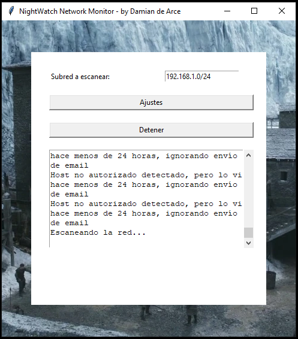

<h1 align="center">NightWatch Network Watcher</h1>

  

  <em>Night gathers, and now my watch begins.</em>

---

NightWatch Network Watcher is a powerful network monitoring tool designed to help you keep an eye on your network's security. It utilizes ARP scanning to identify devices on your network and provides real-time alerts if any unauthorized devices are detected.

NightWatch Network Watcher es una poderosa herramienta de monitoreo de redes diseñada para ayudarte a mantener un ojo en la seguridad de tu red. Utiliza el escaneo ARP para identificar dispositivos en tu red y proporciona alertas en tiempo real si se detectan dispositivos no autorizados.

---

## Features / Características

- **Real-time Monitoring**: NightWatch continuously monitors your network for any unusual activity.
  
  **Monitoreo en Tiempo Real**: NightWatch monitorea continuamente tu red en busca de actividad inusual.

- **Email Alerts**: Receive email alerts when unauthorized devices are detected. Note that NightWatch Network Watcher works with Gmail, so you'll need a Gmail account and an "App Password" ( [Google Help page](https://support.google.com/accounts/answer/185833?hl=en) ).

  **Alertas por Correo Electrónico**: Recibe alertas por correo electrónico cuando se detectan dispositivos no autorizados. Ten en cuenta que NightWatch Network Watcher funciona con Gmail, por lo que necesitarás una cuenta de Gmail y una "Contraseña de Aplicación."

- **Configurable IP Range**: You can specify the IP range to monitor according to your network setup.
  
  **Rango de IP Configurable**: Puedes especificar el rango de IP a monitorear según la configuración de tu red.

- **Allowed Hosts List**: Maintain a list of allowed devices to avoid false alerts.
  
  **Lista de Dispositivos Permitidos**: Mantén una lista de dispositivos permitidos para evitar alertas falsas.

## Getting Started / Empezando

To get started with NightWatch Network Watcher, follow these steps:

1. **Clone the Repository**: Clone this repository to your local machine.

2. **Install Dependencies**: Make sure you have the necessary dependencies installed. You can install them using `pip`:
   
   `pip install -r requirements.txt`
   
4. **Configure Email Settings**: Open the NightWatch Network Watcher and configure your SMTP email settings, sender, and receiver email addresses using the "Ajustes" (Settings) button in the application. For Gmail users, you'll need to generate an "App Password" ( [Google Help page](https://support.google.com/accounts/answer/185833?hl=en) ) to use with NightWatch Network Watcher.

5. **Define IP Range**: Specify the IP range you want to monitor in the "Subred a escanear" (Subnet to scan) field.

6. **Start Monitoring**: Click the "Iniciar" (Start) button to begin monitoring your network. NightWatch will continuously scan the specified IP range for unauthorized devices.

Para comenzar con NightWatch Network Watcher, sigue estos pasos:

1. **Clona el Repositorio**: Clona este repositorio en tu máquina local.

2. **Instala las Dependencias**: Asegúrate de tener las dependencias necesarias instaladas. Puedes instalarlas con `pip`:
   
   `pip install -r requirements.txt`

3. **Configura la Configuración de Correo Electrónico**: Abre NightWatch Network Watcher y configura la configuración de correo SMTP, las direcciones de correo del remitente y del destinatario utilizando el botón "Ajustes" en la aplicación. Para usuarios de Gmail, deberás generar una "Contraseña de Aplicación" ( [página de ayuda de Google](https://support.google.com/accounts/answer/185833?hl=es) ) para usar con NightWatch Network Watcher.

4. **Define el Rango de IP**: Especifica el rango de IP que deseas monitorear en el campo "Subred a escanear".

5. **Inicia el Monitoreo**: Haz clic en el botón "Iniciar" para comenzar a monitorear tu red. NightWatch escaneará continuamente el rango de IP especificado en busca de dispositivos no autorizados.

## Screenshots / Capturas de Pantalla

## Configuration / Configuración

You can configure NightWatch Network Watcher by editing the `config.json` file. This file stores your SMTP email settings, sender and receiver email addresses, and the last scanned subnet.

Puedes configurar NightWatch Network Watcher editando el archivo `config.json`. Este archivo almacena la configuración de correo SMTP, las direcciones de correo del remitente y del destinatario, y la última subred escaneada.

## Known Issues / Problemas Conocidos

- No known issues at the moment.

- No se conocen problemas en este momento.

## Support and Contact / Soporte y Contacto

If you encounter any issues or have questions, feel free to contact us:

Si encuentras algún problema o tienes preguntas, no dudes en contactarnos:

- Email: damian.de.arce@gmail.com
- GitHub Issues: [https://github.com/ddearce/SecOps/issues](https://github.com/ddearce/SecOps/issues)

## License / Licencia

This project is licensed under the MIT License - see the [LICENSE](LICENSE) file for details.

Este proyecto está bajo la Licencia MIT - consulta el archivo [LICENSE](LICENSE) para obtener más detalles.

