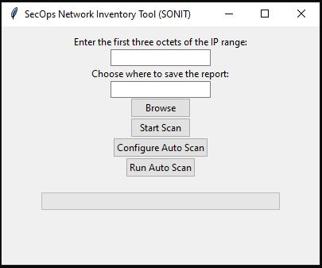

<h1 align="center">SecOps Network Inventory Tool (SONIT)</h1>

  

  <em>Your Ally for Worry-Free Network Inventory.</em>

  <a href="https://github.com/ddearce/SecOps/releases/tag/SONIT"><strong>Descargar Ejecutable</strong></a>

  <a href="https://github.com/ddearce/SecOps/releases/tag/SONIT"><strong>Download Executable</strong></a>

---

SONIT (SecOps Network Inventory Tool) es una herramienta de inventario de red que te permite escanear y rastrear dispositivos en tu red local. Con SONIT, puedes obtener información sobre las direcciones IP, nombres de host, direcciones MAC y puertos abiertos de los dispositivos en tu red.

SONIT (SecOps Network Inventory Tool) is a network inventory tool that allows you to scan and track devices on your local network. With SONIT, you can retrieve information about IP addresses, hostnames, MAC addresses, and open ports of devices on your network.)

---
## Características Principales / Key Features
- Escaneo automático programable en intervalos de tiempo.
- Escaneo manual de red bajo demanda.
- Generación de informes en formato CSV.
- Soporte para Windows y Linux.

## (Main features:)
- Programmable automatic scanning at time intervals.
- On-demand manual network scanning.
- Generation of reports in CSV format.
- Support for Windows and Linux.

## Capturas de Pantalla / Screenshots

## Requisitos / Requirements
- Python 3.x
- Biblioteca tkinter
- Nmap

## Instalación / Installation
1. Clona este repositorio a tu máquina local.
   (Clone this repository to your local machine.)
2. Asegúrate de tener Python 3.x instalado.
   (Make sure you have Python 3.x installed.)
3. Instala las dependencias utilizando pip:
   (Install the dependencies using pip:)
   
`pip install -r requirements.txt`

## Uso / Usage
1. Ejecuta la aplicación utilizando el siguiente comando:
(Run the application using the following command:)
`python SONIT.py`
2. Configura la herramienta según tus preferencias, incluyendo el rango de direcciones IP.
(Configure the tool according to your preferences, including the IP address range.)
3. Inicia un escaneo manual o configura un escaneo automático.
(Start a manual scan or set up an automatic scan.)
4. Visualiza los resultados del escaneo en un informe CSV.
(View the scan results in a CSV report.)

## Contribución / Contribution
Si deseas contribuir a este proyecto, ¡estamos abiertos a tus sugerencias y mejoras! Siéntete libre de crear un problema o enviar una solicitud de extracción.

If you would like to contribute to this project, we are open to your suggestions and improvements! Feel free to create an issue or submit a pull request.)

## Licencia / License
Este proyecto está licenciado bajo la Licencia MIT. Consulta el archivo [LICENSE](LICENSE) para obtener más detalles.

This project is licensed under the MIT License. See the [LICENSE](LICENSE) file for more details.
